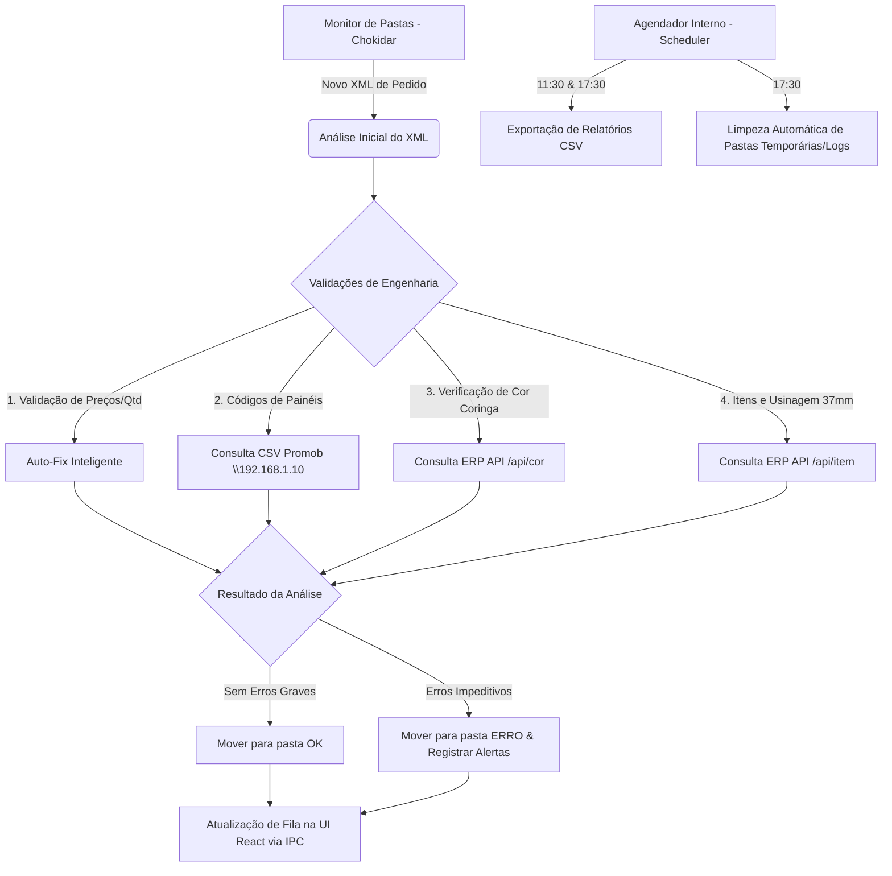

<div align="center">

# 🏗️ Bartz Analyzer

### Sistema Inteligente de Monitoramento e Validação de XML para Produção

[](https://nodejs.org/)
[](https://www.electronjs.org/)
[](https://react.dev/)
[](https://www.typescriptlang.org/)
[](https://tailwindcss.com/)
[](https://vitest.dev/)

</div>

---

## 📸 Preview

<div align="center">
  
  
  
  
</div>

---

## 📌 Sobre o Projeto

O **Bartz Analyzer** é uma ferramenta de missão crítica projetada para o ecossistema produtivo da **Bartz**. Ele atua como uma sentinela inteligente de monitoramento, validação e auto-correção de arquivos XML de pedidos gerados pelo Promob antes que estes cheguem ao chão de fábrica (maquinários como ASPAN e NCB612).

O sistema resolve gargalos de inconsistências em arquivos de exportação que tradicionalmente interrompem a produção ou causam perdas de matéria-prima por usinagem incorreta.

---

## ⚙️ Fluxo de Operação e Arquitetura

O sistema monitora pastas de entrada específicas em tempo real, executa verificações integradas com APIs corporativas (ERP/Pedidos) e encaminha os arquivos processados para pastas de sucesso (`OK`) ou erro (`ERRO`), além de gerar relatórios e auditoria.

### Diagrama de Fluxo e Integrações



---

## ✅ Funcionalidades Principais

- **Monitoramento Ativo em Tempo Real:** Observa ativamente os diretórios locais e de rede configurados via `Chokidar`, reagindo instantaneamente a novos arquivos de pedido.
- **Validação Técnica de Engenharia:**
  - **Usinagem de 37mm:** Detecção automática de furações críticas que exigem atenção especial de engenharia.
  - **Identificação de Coringa (Cor Wildcard):** Garante a consistência na substituição ou validação de cores genéricas no fluxo do pedido.
  - **Filtragem de Maquinário Ativo:** Configurado especificamente para as diretrizes das máquinas `ASPAN` e `NCB612`.
  - **Verificação de Painéis Promob:** Busca dinâmica de códigos de painéis válidos no diretório compartilhado (`\\192.168.1.10\Promob\codigos_paineis.csv`).
- **Integração Fluida com APIs:**
  - **API de Pedidos:** Resgate de metadados cruciais para conferência do lote (`/api_pedidos.php`).
  - **API do ERP:** Validação e pesquisa de códigos/descrições de itens e registros de cores locais.
- **Agendador Inteligente (Scheduler):**
  - **Relatórios Diários:** Geração e exportação automática em lote de relatórios no formato **CSV** para a pasta de relatórios configurada às **11:30** e **17:30**, contendo metadados completos de inconformidades e decodificação otimizada para Excel (**BOM UTF-8**).
  - **Rotina de Limpeza:** Faxina programada diária às **17:30** para manter as pastas de processamento (`ok`, `erro`, `log_proc`, `log_erro`) limpas e otimizadas.
- **Dashboard Interativo em Tempo Real:** Interface elegante construída com React, TypeScript e Tailwind CSS, alimentada por canais IPC de alto desempenho.
  - **Interface Simplificada e Reorganizada (Layout 50/50):** Remoção das configurações de caminhos de rede do painel principal (centralizadas e gerenciadas exclusivamente pela tela de **Opções**), redistribuindo o Dashboard de forma equilibrada com o **Relatório de Atividade** no lado esquerdo e a grade de **Métricas & Filtros (KPIs)** no lado direito.
  - **Seletor de Datas Interativo por Calendário:** Calendário nativo `<input type="date">` acoplado ao cabeçalho que permite visualizar os resultados de qualquer dia do histórico e exportar relatórios manuais direcionados apenas a essa data.
  - **Busca Global Inteligente:** Campo de busca aprimorado que localiza arquivos simultaneamente pelo nome, erros, avisos, tags e status do robô.
  - **Visualização de Auto-Fix Simplificada:** Remoção de colunas redundantes e inclusão de distintivo visual **`AUTO-FIX`** integrado diretamente ao lado das tags do arquivo.
  - **Controle de Visualização de Tags Corrigidas:** Omissão automática de tags originais duplicadas (como `muxarabi` ou `duplado`) quando sua respectiva versão corrigida (`_autofix`) está presente.
  - **Portabilidade Visual de Tema (Color Scheme):** Correção de bugs de cores em computadores rodando o sistema operacional em modo claro, forçando popups e dropdowns nativos do Windows a renderizarem no modo escuro.
  - **Aba de Itens Completa (Visualização & Edição):** Nova funcionalidade que lista todos os itens (pais e filhos) do XML, permitindo alterar suas descrições e visualizar detalhes sem abrir o XML bruto.
  - **Visualização de Desenhos Técnicos:** Integração com botões de "Abrir Desenho" em todas as abas de itens, acelerando as conferências no chão de fábrica.
  - **Abertura Inteligente de Muxarabis:** Abertura automática de arquivos de desenho de Muxarabi (.dxf) conforme a dimensão exigida no pedido (ex: 25x25, 40x25, etc.).
- **Resiliência com Itens Sem Cadastro:** Tratamento e exibição inteligente de itens que não possuem código ou cadastro no ERP.
- **Filtragem de Pedidos de Compra (PO):** Ajuste na lógica para exibir somente códigos de formato `POXXXXXX` com 6 números (em vez de 4).
- **Sistema de Atualização Automática (OTA):** Integração com GitHub Releases permitindo buscar, baixar e instalar novas versões do aplicativo com apenas um clique diretamente pelo Dashboard, incluindo feedback visual de erros e progresso de download.

---

## 🏛️ Estrutura do Código

```
📦 Bartz-Analyzer
 ├── 🖥️ cjs-main.js          # Arquivo de entrada do processo principal (Main Process)
 ├── 🖥️ preload.js           # Ponte de segurança IPC entre Main e Renderer
 ├── 🖥️ electron/            # Módulos do Processo Principal (Watcher, File System, IPC, APIs)
 ├── 📂 Muxarabi/            # Biblioteca de desenhos de Muxarabi (.dxf) por dimensões
 ├── 🎨 src/                 # Processo de Renderização (Interface React + Vite)
 │    ├── 🧩 components/     # Componentes de UI Modulares (Radix UI, Lucide)
 │    │    └── 🗂️ drawer/    # Detalhes do pedido, Abas e Alertas de Engenharia
 │    ├── ⚓ hooks/          # Hooks customizados e comunicação IPC
 │    ├── ⚙️ Settings.ts     # Gerenciamento de configurações locais persistentes
 │    ├── 🛠️ lib/            # Utilitários (xml-logic, tailwind-merge, etc)
 │    └── 🏷️ types/          # Definições de tipos globais TypeScript
 ├── 🧪 tests/               # Testes unitários da lógica de validação do XML
 ├── 📜 docs/                # Documentação complementar, esquemas e imagens
 └── 🐳 Dockerfile           # Configuração de containerização para ambiente de testes/build
```

---

## 🚀 Comunicação entre Processos (IPC)

O processo principal (Node/Electron) transmite relatórios de análise detalhados para o processo de renderização (React) em tempo real.

### Payload de Resposta da Validação (Exemplo)
```json
{
  "arquivo": "C:\\Producao\\67996_pedido_exemplo.xml",
  "erros": [
    { "descricao": "USINAGEM DE 37MM DETECTADA EM PEÇA LATERAL", "gravidade": "warning" }
  ],
  "tags": ["usinagem_37", "cor_coringa_resolvida"],
  "meta": {
    "num_pedido": 67996,
    "maquinas": [
      { "id": "aspan", "name": "ASPAN" },
      { "id": "ncb612", "name": "NCB612" }
    ]
  }
}
```

---

## 💻 Instalação e Desenvolvimento

### Pré-requisitos
* **Node.js** v20 ou superior
* **npm** v10 ou superior

```bash
# 1. Instalar as dependências do projeto
npm install

# 2. Iniciar o ambiente de desenvolvimento (React + Electron em paralelo)
npm run dev
```

---

## 📦 Como gerar o Executável (.exe)

O projeto está configurado com `electron-builder` para empacotar a aplicação de forma rápida e autônoma para Windows.

Execute o comando abaixo:
```bash
npm run dist:win
```

### O que o script de distribuição faz?
1. Compila e otimiza o código React/Vite na pasta `/dist` (`npm run build`).
2. Empacota a aplicação com suporte a atalhos na Área de Trabalho e Menu Iniciar.
3. Produz um instalador auto-suficiente na pasta **`/release`**.

---

## 🧪 Testes

A integridade matemática e lógica de parsing/validação dos XMLs é testada de forma isolada com `Vitest`.

```bash
# Executar a suíte de testes unitários
npm test
```

---

## 🛠️ Stack Tecnológica

| Tecnologia | Versão | Finalidade |
|-----------|--------|------------|
| **Electron** | 37 | Runtime de Desktop nativo |
| **React** | 18 | Interface de usuário componentizada |
| **Vite** | 7 | Bundler e Servidor de desenvolvimento rápido |
| **TypeScript** | 5.9 | Tipagem estática e segurança em tempo de compilação |
| **Tailwind CSS** | 3.4 | Framework de estilização utilitária e responsiva |
| **Radix UI** | — | Primitivos de componentes acessíveis e acessibilidade |
| **Chokidar** | 4.0 | Monitoramento de File System de alta performance |
| **Vitest** | 3.2 | Framework de testes rápido baseado em ESM |
| **Electron Store** | 11.0 | Banco de dados chave-valor para configurações persistentes |

---

## 👨‍💻 Contribuição e Autoria

Desenvolvido por **Beto Lara** — Backend & Desktop Developer

[](https://github.com/betolara1)

---

<div align="center">

**Bartz Analyzer** — Monitoramento inteligente para uma produção sem interrupções.

> **Nota:** Este projeto conta com o auxílio de IA avançada (**Antigravity**) para aceleração de desenvolvimento, refinamentos visuais premium e garantia de boas práticas arquiteturais.

</div>