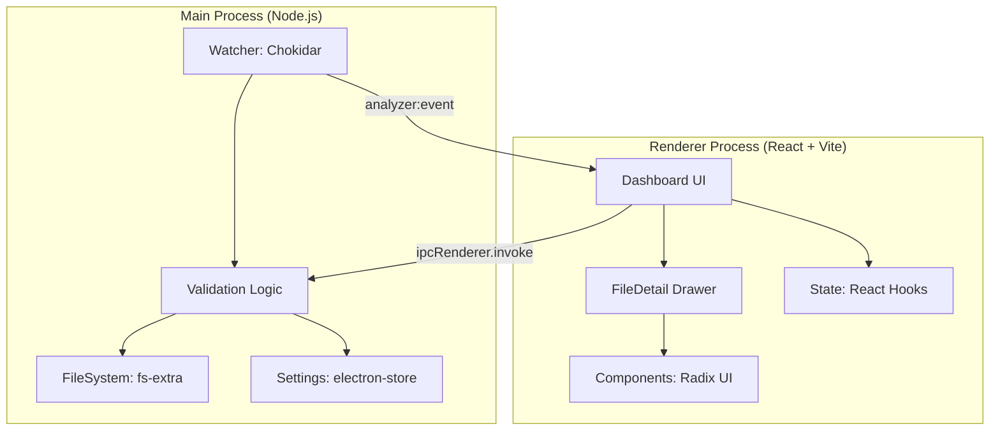

# Bartz Analyzer 🚀

> **Nota:** Este projeto foi desenvolvido com o auxílio de inteligência artificial (**Antigravity**) para garantir agilidade e padrões profissionais de código.

Sistema robusto de monitoramento e validação de arquivos XML para o fluxo produtivo da Bartz. O **Bartz Analyzer** automatiza a detecção de erros comuns, aplica correções inteligentes e organiza a fila de produção em tempo real.

---

## 🎯 Objetivo & Problema

### O Problema
No processo de exportação de pedidos para a produção, arquivos XML podem conter inconsistências técnicas (preços zerados, quantidades nulas, códigos de cores pendentes ou usinagens especiais de 37mm) que interrompem o fluxo de máquinas ou geram peças incorretas. A validação manual desses arquivos é lenta e suscetível a erro humano.

### A Solução
O Bartz Analyzer atua como uma **sentinela inteligente**. Ele monitora pastas de rede, intercepta arquivos XML no momento em que são gerados, aplica uma bateria de testes automatizados e:
- Corrige instantaneamente erros triviais (Auto-fix).
- Alerta sobre problemas complexos que exigem decisão humana.
- Garante que apenas arquivos 100% validados cheguem às máquinas.

---

## 🏗️ Arquitetura do Sistema

O sistema é construído sobre o ecossistema **Electron**, utilizando um modelo de comunicação assíncrona entre o processo principal (Node.js) e o processo de renderização (React).



---

## 🚀 Como Rodar

### Ambiente de Desenvolvimento
**Pré-requisitos:** [Node.js](https://nodejs.org/) (v18+)

1. Clone o repositório e instale as dependências:
   ```bash
   npm install
   ```
2. Inicie o modo de desenvolvimento:
   ```bash
   npm run dev
   ```
   *O Vite servirá o frontend na porta 5174 e o Electron abrirá automaticamente.*

### Produção / Build
Para gerar o executável Windows (.exe):
```bash
npm run build
npm run dist:win
```
O instalador será gerado na pasta `release/`.

---

## 🐳 Docker

Para garantir consistência no ambiente de build ou execução em containers:

**Rodar via Docker Compose:**
```bash
docker-compose up --build
```

---

## 🧪 Testes

O projeto utiliza **Vitest** para garantir a integridade da lógica de validação XML.

**Executar a suíte de testes:**
```bash
npm test
```
*Atualmente com mais de 10 testes cobrindo: detecção de ES08, coringa, auto-fix de preços/quantidades e validação de máquinas.*

---

## 🛠️ Exemplos de Comunicação (IPC)

O sistema utiliza o padrão `invoke/handle` para comunicação segura:

**Exemplo de Resposta de Validação (Payload):**
```json
{
  "arquivo": "C:\\Caminho\\Pedido.xml",
  "erros": [{ "descricao": "ITEM SEM CÓDIGO" }],
  "tags": ["sem_codigo", "coringa"],
  "meta": {
    "coringaMatches": ["PAINEL_CG1_18"],
    "machines": [{ "id": "2341", "name": "Cyflex 900" }]
  }
}
```

---

## 📷 Screenshots

### Dashboard Principal


### Interface de Detalhes
<p align="center">
  
  
</p>

---

## 🤖 CI/CD (GitHub Actions)
O projeto conta com um pipeline automatizado que executa:
1. **Lint**: Verificação de padrões de código (**ESLint**).
2. **Build**: Garantia de que o projeto compila sem erros.
3. **Tests**: Execução automática da suíte de testes.

Consulte `.github/workflows/ci.yml` para detalhes.

---
© 2026 Bartz - Desenvolvido com auxílio de IA.


2. Unificação de Componentes de UI
Existem dois conjuntos de componentes para as mesmas funções. O ideal é manter apenas a versão "Enhanced/Figma", que é visualmente superior, e movê-la para o diretório principal de componentes.

Unificar Badges: Substituir ErrorBadge.tsx pelo BadgeErro.tsx.
Unificar Chips: Substituir StatusChip.tsx pelo ChipStatus.tsx.
Unificar Cards: Substituir KPICard.tsx pelo CardKPI.tsx.
Padronização: Mover esses componentes de src/components/figma/ para src/components/ para que sejam o padrão do app.


3. Decomposição do FileDetailDrawer.tsx (126KB)
Este arquivo é o maior do projeto e contém lógica de busca no ERP, DXF, Coringas, além de toda a interface.

Sub-componentes: Criar uma pasta src/components/drawer/ e extrair cada seção (Erros, Máquinas, Chave de Importação, Busca ERP, etc) para arquivos próprios.
Hook de Ações: Mover a lógica de handleErpSearch, searchAllDrawings e fixFresa37to18 para um hook customizado (ex: useFileActions.ts).


4. Otimização do Dashboard.tsx (52KB)
O Dashboard atual mistura lógica de monitoramento de arquivos com a renderização da tabela.

Extração de Hook: Mover toda a lógica de useEffect (listeners de eventos do Electron) e filtragem de rows para um hook customizado useDashboardLogic.ts.
Uso do EnhancedDashboard: Migrar definitivamente para o layout do EnhancedDashboard.tsx, que é mais moderno.


5. Centralização de Tipos
Criar um arquivo src/types/index.ts para centralizar as interfaces Row, FileData, ProcessResult, etc., que hoje estão espalhadas e duplicadas em vários arquivos.

Podemos começar pela Limpeza (Item 1) e Unificação de Componentes (Item 2)? Se aprovado, prepararei as alterações para esses pontos primeiro.